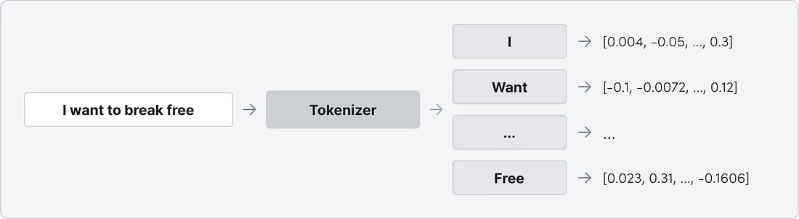

# 🧠 Summer of Code: Building LLM from Scratch

This repository documents my weekly progress and key learning insights while working on the **Summer of Code Project at IIT Bombay** on the topic: **"Building a Large Language Model (LLM) from Scratch"**.

---

## 📅 Weekly Progress

### ✅ Week 1: Foundation Setup
- Revised Python syntax and PyTorch fundamentals.
- Reviewed core neural network concepts (forward/backward pass, gradient descent).
- Studied key deep learning concepts and their relation to LLMs.
- Watched videos 1–6 of the course playlist.

---

### ✅ Week 2: Tokenization and Input Embeddings
**Implemented:**
- Word Tokenizer
- Character-based Tokenizer
- Subword Tokenizer using Byte Pair Encoding (BPE)

**Learned:**
- Token embeddings and positional embeddings.
- Input-target pair creation for training LLMs.
- Context window and its impact on sequence modeling.
- Watched videos 7–12.

---

### ✅ Week 3: Attention Mechanism
**Implemented:**
- Basic dot-product attention (non-trainable)
- Self-attention mechanism
- Causal (masked) attention for autoregressive behavior
- Multi-head attention with parallel attention heads

**Watched videos 13–18.**

---

### ✅ Week 4: Basic LLM Implementation
- Implemented a simple Large Language Model (LLM) using all previously learned concepts.

---

Attention mechanisms play a crucial role in neural networks by allowing the model to focus on specific parts of the input text when generating an output. These mechanisms, inspired by human cognitive processes, allow language models to focus on relevant information while processing text.

In this primer, we will explore the fundamentals of attention mechanisms, exploring their role in large language models (LLMs). Drawing insights from the paper “Attention is All You Need,” we will also explore attention and its transformative impact on language understanding.

Before diving into attention mechanisms, let’s first understand a few fundamental concepts.

## Embeddings: 
Embeddings are a way to represent words or entities in a lower-dimensional vector space. These vectors capture semantic meaning, allowing algorithms to understand relationships between words or items.

## Tokenization: 
Tokenization breaks text into smaller units, or tokens, like words or characters, facilitating natural language processing tasks. It transforms text into a structured format for analysis, enabling tasks such as part-of-speech tagging and sentiment analysis.

Variations exist in tokenization methods, considering factors like whitespace or punctuation. This process is foundational in NLP pipelines for effective text analysis.

## Linear Transformation: 
In mathematics and computer science, a linear transformation refers to a function that maps vectors from one space to another while preserving certain properties such as linearity and proportionality. In the context of neural networks, linear transformations are often represented by matrices that transform input data into a different representation through matrix multiplication and addition.

## Attention is all you need
Paper — https://arxiv.org/abs/1706.03762

The paper titled “Attention is All You Need” marked a significant advancement in artificial intelligence. It introduced the Transformer architecture, which allows machines to understand language and complex information more effectively. At the heart of this architecture is the concept of “self-attention,” which enables AI models to analyze language nuances similar to how a skilled musician interprets musical notes.

Attention mechanisms dynamically weigh the importance of different words or tokens in the input sequence. By doing so, attention enables the model to capture long-range dependencies and understand context more effectively. As a result, it improves the model’s performance in tasks such as language translation, text summarization, and question answering.

For example, when encountering the word apple , attention might prioritize information about fruit or technology depending on the surrounding context.

Apple unveiled a new smartphone model at their latest product launch event

In the above example, the model would attend to all words in the sentence and prioritize apple towards smartphone due to their close semantic association

Please buy an apple and an orange from the grocery store

In the above example, the model would attend to all words in the sentence and prioritize apple towards orange due to their close semantic association.

This enables the model to generate more relevant responses by weighting different parts of the input differently, similar to how our attention shifts depending on the context of a conversation or text.

## Types of Attention mechanisms
There are several types of attention mechanisms, including:

## Self-Attention:
This allows LLMs to understand the context of each word in relation to every other word in the sequence, capturing dependencies and relationships across long distances. This mechanism is particularly advantageous for processing sequences with variable lengths and complex structures, as it facilitates the extraction of relevant information while maintaining computational efficiency.

For example, let’s consider the below sentence:
I enjoy eating apples.

When the model encounters the word apple it needs to understand its context within the sentence. With self-attention, the model can focus on the word apple and determine how relevant it is to the rest of the sentence. It might give more attention to the word eating to understand that apple is being consumed as food, while also considering the word appleto understand the positive sentiment associated with eating apples.

## Scaled Dot-Product Attention: 
This involves computing the dot product between a query vector and a set of key vectors, and then scaling the result by the square root of the dimensionality of the key vectors. This scaling helps to prevent the dot products from growing too large, which can lead to instability during training.

we compute the attention function on a set of queries simultaneously, packed together into a matrix Q. The keys and values are also packed together into matrices K and V . We compute the matrix of outputs as: [ 1]

For example, Imagine we are trying to decide which aspect of appleto focus on, either as a fruit or as a technology company. We assign a score to each aspect based on its relevance to your discussion. Then, to manage these scores better, we scale them down. Finally, we multiply each aspect’s score by its relevance to the overall context to get its final importance score. The aspect with the highest score receives the most attention and is likely to be emphasized in your discussion.

## Multi-Head Attention: 
Multi-head attention is a mechanism that enhances the model’s ability to process input sequences. Instead of relying on a single attention head, which computes weighted sums of input elements based on their relevance to a specific context, multi-head attention employs multiple attention heads simultaneously. Each head focuses on different aspects of the input, such as local dependencies, global context, or specific patterns. By combining the outputs from these heads, the model gains a richer understanding of the input, leading to improved performance across various tasks.

Multi-head attention allows the model to jointly attend to information from different representation subspaces at different positions. With a single attention head, averaging inhibits this. [1]

Multi-head attention is like having multiple sets of eyes, each focusing on different aspects of information at the same time.

For example, suppose we are analyzing a sentence like below:

I enjoy eating apples, and I also love using Apple products.

In this case, one attention head might focus on the word applesin the context of fruits, paying attention to words like eating and love nearby. Meanwhile, another attention head might focus on Apple products considering words like using and love to understand the reference to the technology company.

By having multiple attention heads processing the word apple simultaneously from different perspectives, the model can capture a richer understanding of the sentence, distinguishing between the fruit and the technology company in the context of the sentence.